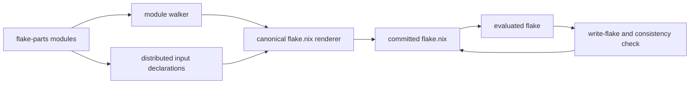

# Nucleation

> Each flake begins by forming around a tiny particle, called its nucleus.

`nucleus` replaces my previously-used [flake-file](https://github.com/denful/flake-file), [import-tree](https://github.com/denful/import-tree) stack with a small local implementation. It preserves only the three properties this repo's architecture needs:

1. Every flake-parts module below `modules/` is discovered automatically.
2. A module can declare a flake input beside the configuration that consumes it.
3. Modules can contribute named NixOS and Home Manager modules through the mergeable `flake.modules.<class>.<name>` registry.

## Scope

The nucleus is not intended to reproduce flake-file's general API or import-tree's combinators. It excludes alternative output presets, npins, custom filtering pipelines, scoped imports, arbitrary writer hooks, and a configurable formatting policy.

Keeping the contract narrow makes local ownership practical. nucleus is not a general-purpose utility meant to be consumed; it should always be built-to-purpose.

`nucleus` provides a bootstrap mechanism and failure introspection by means of artifact retention, but no rollback or versioning mechanisms. Git remains the authoritative recovery route for semantic module failures and for restoring an earlier lock state; recovery features are explicitly out-of-scope.

## Architecture and invariants

The generated `flake.nix` is a committed artifact: it provides the input graph needed to evaluate the modules that generate its next revision. This bootstrap cycle retains ordinary `nix flake update`, input overrides, and lock-file tooling.



`nucleus/list-modules.nix` discovers Nix files below `modules/` in deterministic lexical order. It preserves import-tree's default exclusion of underscore-prefixed files and directories. Since the generated flake supplies these paths to flake-parts, every discovered file must remain a flake-parts module.

The local flake-parts module declares `flake.modules` as two lazy attribute layers whose leaves are deferred modules. The outer key identifies the module class, such as `nixos` or `homeManager`, and the inner key is its exported name. This schema lets separate discovered files contribute independent exports while allowing definitions of the same class/name pair to compose through the deferred module type. This is part of the repository architecture, not a general nucleus API.

## Declaring inputs

The local flake-parts module exposes `nucleus.inputs`. A consumer declares an input adjacent to the module that uses it:

```nix
{
  nucleus.inputs.example = {
    url = "github:owner/example";
    inputs.nixpkgs.follows = "nixpkgs";
  };
}
```

Declarations merge through the Nix module system. The initial schema is intentionally narrow: `url`, `flake`, `follows`, and recursive input overrides. Because this isn't intended to be a general-purpose consumable: additional fields should only be implemented when a real dependency requires it.

Input ownership follows this repo's ownership convention:

- Place broadly shared or foundational inputs in `modules/inputs/`. These need occasionally auditing to determine usage across the flake.
- Keep a one-off input in the flake-parts module that consumes it. This way, removal of a sole consumer also removes the input.

## Generation, validation, and recovery

With `nucleus.enable = true`, the nucleus module provides a generated source package, a `write-flake` app, and a consistency check. The check reports when committed `flake.nix` differs from the canonical rendering.

Normal writing is transactional:

1. Parse the generated candidate.
2. Back up the active `flake.nix` and `flake.lock`.
3. Temporarily install the candidate and refresh its lock graph.
4. Run `nix flake check --no-build`.
5. Keep the candidate only if validation succeeds; otherwise restore both active files.

On failure, the writer retains the candidate, attempted lock file, validation log, and backups in a reported temporary artifact directory. The `write-flake --no-check` escape hatch installs generated source without parsing, lock refresh, or validation.

To initialize the project, or to recover if a broken input declaration prevents the normal writer from evaluating, run:

```sh
./nucleus/bootstrap.sh
```

It temporarily installs `nucleus/bootstrap-flake.nix`, a minimal source containing only the inputs needed to evaluate the generator, then asks the local generator to write without validation and refreshes the generated flake's lock graph.
